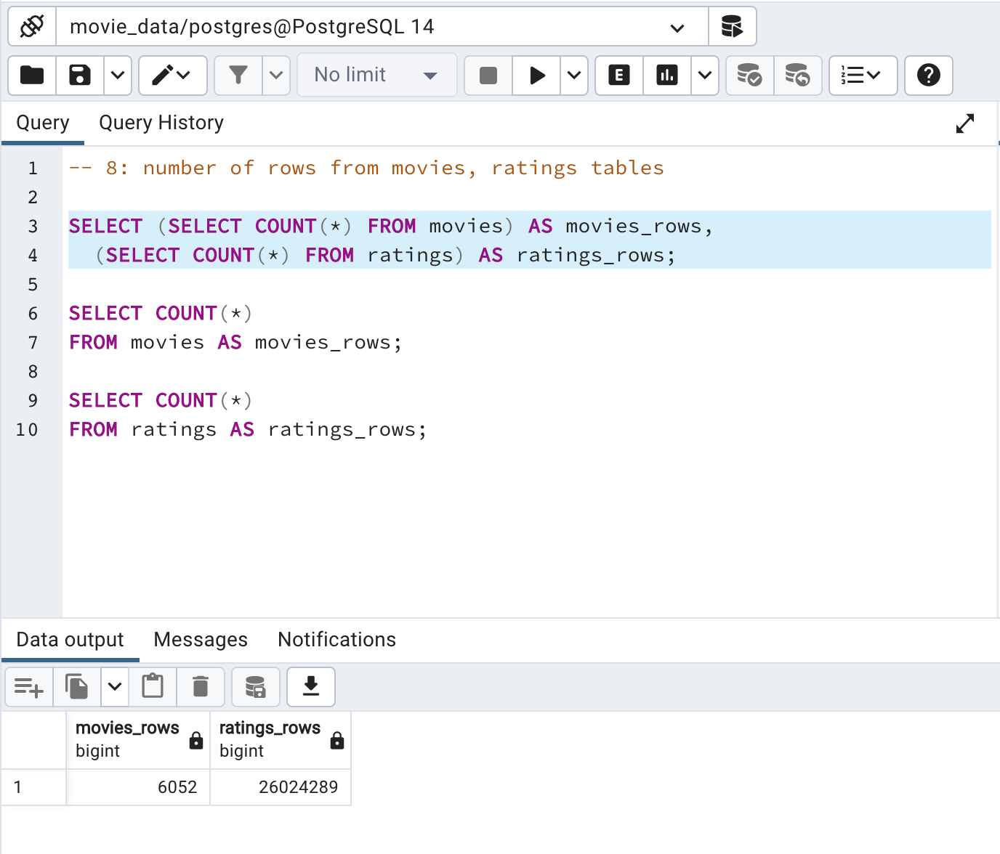

# Movies-ETL

## 1. Project Overview

Here, I used Python in Jupyter Notebooks to clean publicly-available movie data into a useable format. 
I used a series of functions to execute an extract, transform, and load (ETL) pipeline on consolidated but uncleaned data
from Wikipedia, Kaggle, and MovieLens. The end product is a SQL database of two dataframes with movie production data and ratings.

## 2. Results

Complete raw analyses are available in the notebook ```ETL_create_database.ipynb```
Subsets of the analysis, including some results, are in the notebooks ```ETL_function_test.ipynb```, 
```ETL_clean_wiki_movies.ipynb```, and ```ETL_clean_kaggle_data.ipynb```

The final data tables ('movies' and 'ratings') contain information on movie production (title, cast, release date, box office revenue, etc.) and
public user ratings from MovieLens, respectively. 

Confirmation of the tables' cleaned status in a PostgreSQL database is available in the 'resources' file:


